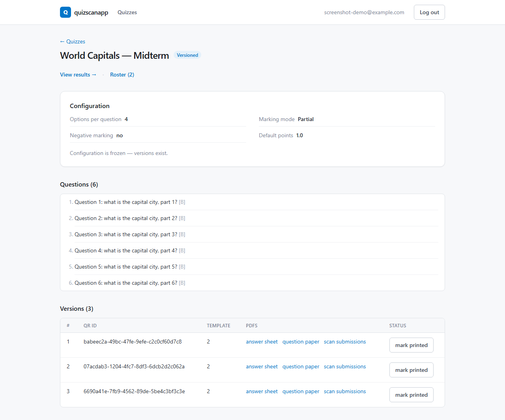
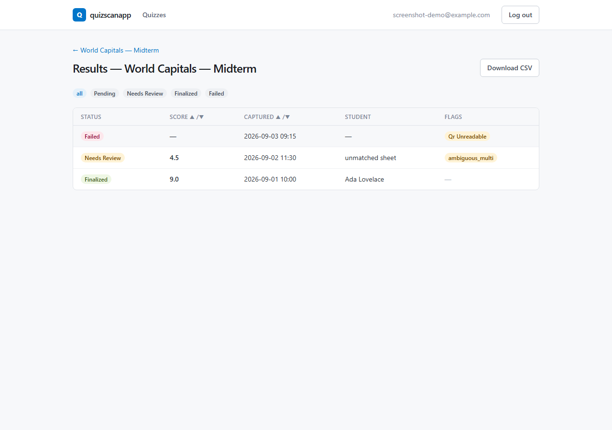
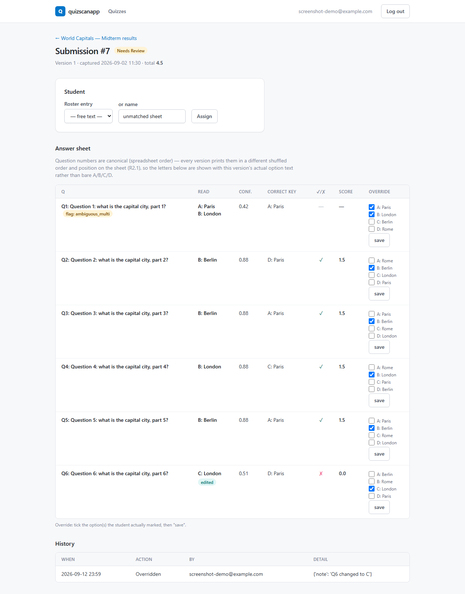
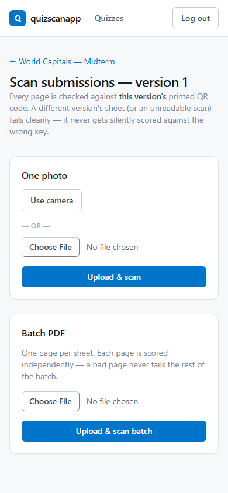
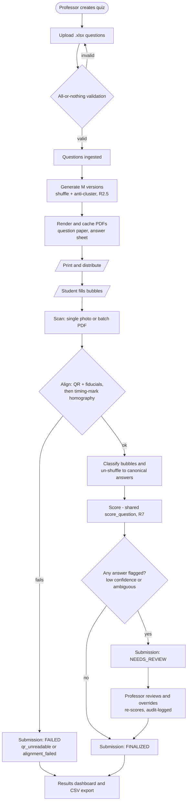
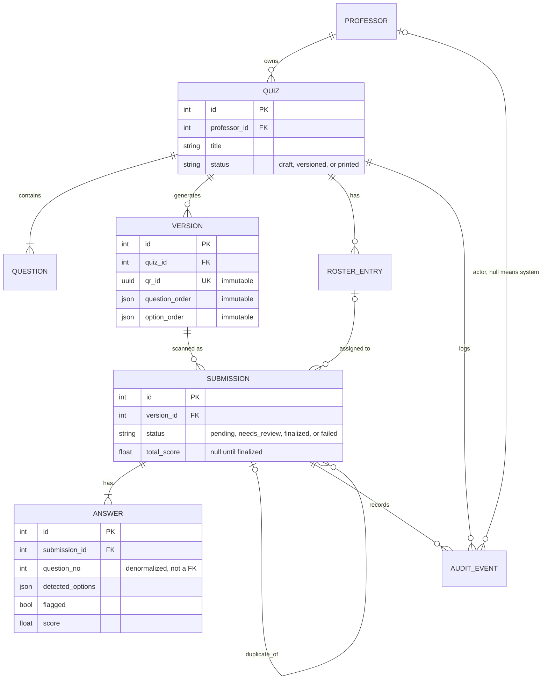

# quizscanapp — Exam Version Generator & Scanner

**Repo:** [github.com/LHedi22/QuizApp](https://github.com/LHedi22/QuizApp)

[](https://github.com/LHedi22/QuizApp/actions/workflows/ci.yml)

A professor uploads MCQ questions once; the system produces N shuffled paper
versions and print-ready OMR answer sheets, then reads photographed/scanned
completed sheets, un-shuffles them to the canonical key, grades against a
configurable marking scheme, and shows a results dashboard with a review
queue for anything it was unsure about. No LLM anywhere on the grading path
— alignment, bubble-reading, and scoring are all classical, deterministic
code (`tests/test_no_llm_on_grading_path.py` enforces this in CI).

**Status:** every phase in the build plan is complete and verified except
one intentionally-deferred optional aid (an LLM review-queue suggestion tool,
held back pending real evidence the review queue needs it). See
[`docs/CLAUDE.md`](docs/CLAUDE.md) "Current state" for details.

## Screenshots

| Quiz detail | Results dashboard |
|---|---|
|  |  |

| Submission review | Scan upload (phone width) |
|---|---|
|  |  |

Built on Tailwind CSS with a color system mapped from the SMU brand palette
(semantic tokens for primary/accent/success/warning/danger — see
`tailwind.config.js`). Demo data shown; no real student data.

## Features

- **Quiz authoring** — create a quiz, upload questions via `.xlsx`
  (all-or-nothing validation: a bad row rejects the whole file, nothing
  partial is ever saved), configure options-per-question, marking mode,
  and negative marking.
- **Version generation** — shuffles question order and option order per
  version, with anti-clustering (no two consecutive correct answers land on
  the same letter more than the allowed run) and a feasibility guard that
  refuses an impossible `M` up front rather than looping forever.
- **Print-ready PDFs** — deterministic ReportLab-rendered answer sheets
  (fiducials, timing marks, a QR code identifying the exact version) and
  question papers, cached by template version.
- **Scan intake** — single-photo upload with in-browser camera capture
  (live preview, blur/QR-decodability pre-check before you even submit) or
  batch PDF upload (one page per sheet, each scored independently).
- **Classical OMR pipeline** — two-stage homography alignment (coarse
  QR/fiducial fit → strict timing-mark fit), per-bubble fill classification,
  and a confidence gate that flags anything it isn't sure about rather than
  guessing.
- **Review queue** — flagged answers pinned first, one-click override that
  re-scores through the exact same scoring function graded submissions use,
  full audit trail (append-only).
- **Results dashboard** — filter/sort by status and score, CSV export.
- **Ops** — `docker compose` up/down, scripted backup/restore with a
  byte-for-byte verified round-trip, demo-data reseed script.

## Architecture

One `docker compose` stack on `localhost` — no TLS, no reverse proxy, no
remote deploy (this is a single-professor prototype by design, not a
SaaS). Full diagrams (system/deployment, module layout, end-to-end
pipeline, database ER model) are in **[`docs/architecture.md`](docs/architecture.md)**;
the two most load-bearing ones are inlined below.

### End-to-end pipeline



### Database schema



## Tech stack

| Layer | Choice |
|---|---|
| Backend | Django (monolith, server-rendered templates) |
| Database | Postgres |
| Auth | Framework-native session auth, email-keyed, open self-signup, no password reset (admin resets it) |
| Blob storage | Local filesystem volume (PDFs, scanned photos) |
| PDF rendering | ReportLab (answer sheet) / Platypus (question paper) |
| OMR | Classical OpenCV + `pyzbar` (QR) — homography alignment, bubble-fill classification, no ML/LLM |
| Background jobs | Django-Q2 (batch scan processing) |
| Frontend | Server-rendered templates + Tailwind CSS (compiled via the Tailwind CLI, no JS framework) |
| Deployment | `docker compose` (app + worker + postgres), WhiteNoise for static files, no reverse proxy |

## Dev quickstart

```bash
python -m venv .venv
.venv/Scripts/python -m pip install -e ".[dev]"     # Windows; drop the .venv/Scripts prefix on macOS/Linux
.venv/Scripts/ruff check .
.venv/Scripts/python -m pytest -q
```

Frontend build (Tailwind CSS — only needed if you're editing templates
outside Docker; Docker always rebuilds it fresh, see `deploy/RUNBOOK.md`):

```bash
npm install
npm run watch:css     # rebuilds app/web/static/web/app.css on every edit
```

## Run it

Prerequisite: Docker Desktop running.

```bash
cp deploy/.env.example deploy/.env
# set a real SECRET_KEY, e.g.:
python -c "import secrets; print('SECRET_KEY=' + secrets.token_urlsafe(64))"   # paste into deploy/.env

docker compose --env-file deploy/.env -f deploy/docker-compose.yml up -d --build
```

This builds the frontend (Tailwind CSS) and Python image, then starts
Postgres + the Django app + the Django-Q2 worker. The app container runs
migrations and `collectstatic` on boot.

App on `http://localhost:${APP_PORT}` (default 8010). Verify with:

```bash
curl -fsS http://localhost:${APP_PORT}/healthz      # -> {"status": "ok"}
```

Create a login (or self-sign-up at `/accounts/register/`):

```bash
docker compose --env-file deploy/.env -f deploy/docker-compose.yml exec app python manage.py createsuperuser
```

To stop: `docker compose --env-file deploy/.env -f deploy/docker-compose.yml down` (keeps data).

First run, backup/restore, wipe-and-reseed, and troubleshooting (port
conflicts on Windows, Docker Desktop issues, etc.):
**[`deploy/RUNBOOK.md`](deploy/RUNBOOK.md)**.

## Testing

```bash
.venv/Scripts/ruff check .
.venv/Scripts/python -m pytest -q          # 490+ tests, needs Postgres — see deploy/RUNBOOK.md
bash scripts/ci.sh                         # full CI locally: lint + tests + clean-DB migrate + backup/restore round-trip
```

## Project structure

```
app/
  core/       domain models, services, xlsx ingestion, scan-pipeline orchestration
  grading/    pure scoring + version-shuffling engine (no Django imports)
  omr/        pure alignment/classification engine (no Django imports)
  pdf/        answer sheet / question paper rendering
  web/        views, forms, urls, templates (Tailwind CSS)
config/       config/sheet_template.json — the one shared answer-sheet geometry source
deploy/       Dockerfile, docker-compose.yml, RUNBOOK.md, backup/restore scripts
docs/         spec, working rules, progress log, phase breakdowns, architecture diagrams
scripts/      demo seed, load test, CI helper scripts
tests/        pytest suite (unit, integration, end-to-end, corpus-based OMR accuracy)
corpus/       real hand-captured answer-sheet photos used to calibrate/verify the OMR pipeline
```

## Docs

- [`docs/REBUILD_SPEC.md`](docs/REBUILD_SPEC.md) — single source of truth for scope and requirements
- [`docs/CLAUDE.md`](docs/CLAUDE.md) — working rules and current build status
- [`docs/PROGRESS.md`](docs/PROGRESS.md) — dated build log, one entry per subtask/feature
- [`docs/phases/`](docs/phases/) — per-phase task breakdowns
- [`docs/architecture.md`](docs/architecture.md) — full diagram set (deployment, modules, pipeline, ER model)
