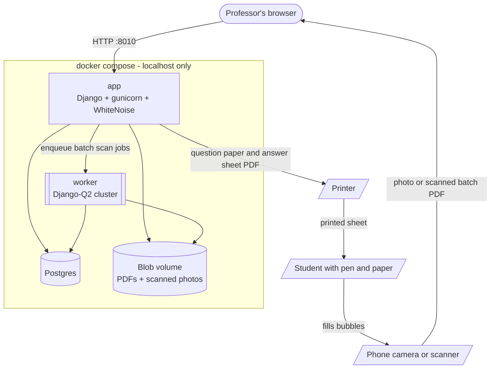
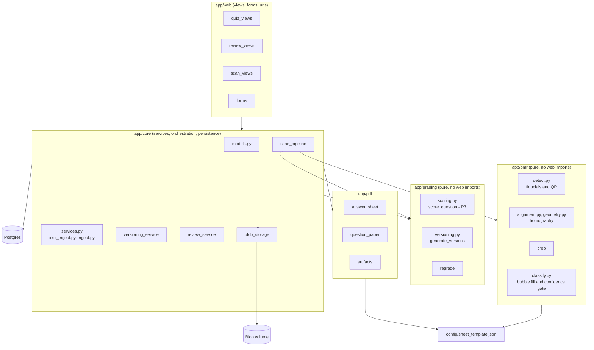
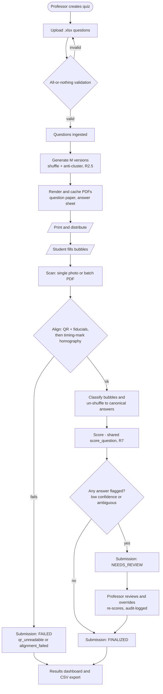
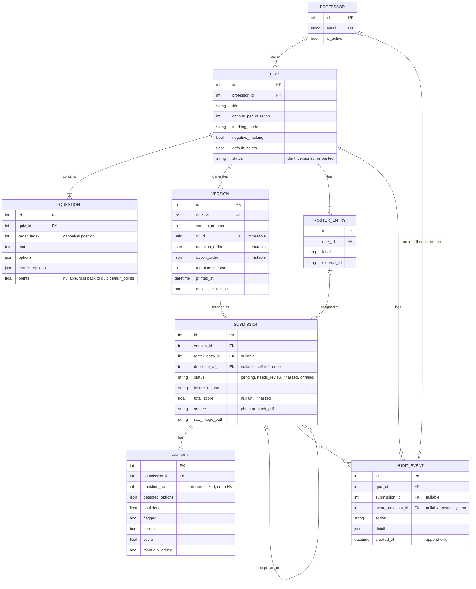

# Architecture

Diagrams reflect the current, fully-built state of the app (see
`docs/CLAUDE.md` "Current state" / `docs/PROGRESS.md` for the build log).
Regenerate this file if the module layout, pipeline, or schema changes
materially — read the actual code, don't hand-wave.

## 1. System / deployment architecture

One `docker compose` stack on `localhost` — no TLS, no reverse proxy, no
remote deploy (by design; this is a single-professor prototype). The
professor's browser is the only software client; the printer, the printed
sheet, and the student's pen are physical-world actors outside the app.

## 2. Module architecture

The Django web layer is a thin shell around two **pure, framework-free**
engines — `app/grading` and `app/omr` must stay importable with zero
web-framework imports (`docs/CLAUDE.md` rule 7), so they're testable in
isolation and the scoring/alignment math can never accidentally depend on a
request context. `app/pdf` and the OMR pipeline share one geometry source of
truth: `config/sheet_template.json`.

## 3. End-to-end pipeline

One quiz's full life, from question upload to a reviewed result. Every
`FAILED` / `NEEDS_REVIEW` exit is a deliberate clean-failure — a bad scan
never gets silently graded against the wrong key.

## 4. Database schema (ER diagram)

Eight domain tables. `Version.question_order` / `option_order` / `qr_id` are
immutable after creation (R2.7, enforced in `save()` **and** a DB trigger);
`AuditEvent` rows are append-only (R6.5, DB trigger blocks `UPDATE`).
`Answer.question_no` is a **denormalized canonical index** correlated to
`Question.order_index` within the same quiz — it is not a foreign key (every
printed version shuffles question order and bubble position, so the FK would
have to point at a different `Question` per version anyway).

